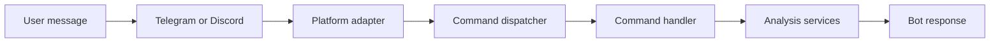

# Bot command guide

이 문서는 현재 유지되는 KR/US 주식 분석 봇 명령과 연동 범위를 설명합니다.

## Supported platforms

현재 문서 기준의 지원 범위는 다음과 같습니다.

| Platform | Purpose | Configuration |
| --- | --- | --- |
| Telegram | 분석 결과 전송, 토픽 전송 | `TELEGRAM_BOT_TOKEN`, `TELEGRAM_CHAT_ID`, `TELEGRAM_MESSAGE_THREAD_ID` |
| Discord | Webhook 또는 Bot API 기반 결과 전송 | `DISCORD_WEBHOOK_URL` 또는 `DISCORD_BOT_TOKEN` + `DISCORD_MAIN_CHANNEL_ID` |
| AstrBot | 외부 챗봇 게이트웨이로 결과 전송 | `ASTRBOT_URL`, `ASTRBOT_TOKEN` |

Webhook 명령 처리 코드는 공통 `bot/` 모듈을 사용합니다. 플랫폼 어댑터는 메시지를 `BotMessage`로 정규화하고, 명령 디스패처가 공통 명령을 실행한 뒤 `BotResponse`를 각 플랫폼 응답 형식으로 변환합니다.

## Command flow



## Command model

주요 모델은 `bot/models.py`에 정의되어 있습니다.

```python
@dataclass
class BotMessage:
    platform: str
    message_id: str
    user_id: str
    user_name: str
    content: str
    channel_id: Optional[str] = None
    group_id: Optional[str] = None
    raw_data: Dict[str, Any] = field(default_factory=dict)


@dataclass
class BotResponse:
    text: str
    markdown: bool = False
    at_user: bool = True
```

명령은 기본 접두사 `/`를 사용합니다. 접두사는 `BOT_COMMAND_PREFIX`로 바꿀 수 있습니다.

## Available commands

| Command | Alias | Description | Examples |
| --- | --- | --- | --- |
| `/analyze <stock_code> [full]` | `/a`, `/분석` | KR 또는 US 종목 분석 작업을 제출합니다. | `/analyze 005930`, `/analyze AAPL full` |
| `/ask <stock_code> [strategy]` | `/q`, `/질문` | 종목에 대해 지정 전략 또는 기본 전략으로 질의합니다. | `/ask 005930`, `/ask AAPL momentum` |
| `/batch [count]` | `/b`, `/일괄` | 관심 종목 목록을 일괄 분석합니다. | `/batch`, `/batch 5` |
| `/chat <question>` | 없음 | 일반 질의를 봇 세션으로 전달합니다. | `/chat 오늘 시장 요약해줘` |
| `/market` | `/m`, `/시장` | KR/US 시장 리뷰를 요청합니다. | `/market` |
| `/status` | `/s`, `/상태` | 시스템, 데이터, 알림 설정 상태를 확인합니다. | `/status` |
| `/help [command]` | `/h`, `/도움말` | 전체 명령 또는 특정 명령 도움말을 표시합니다. | `/help`, `/help analyze` |

## Stock code examples

지원 예시는 KR 6자리 코드와 US 티커입니다.

```text
/analyze 005930
/analyze 000660 full
/analyze AAPL
/analyze MSFT full
```

유효하지 않은 코드 형식은 명령 실행 전에 거부됩니다.

## Configuration

기본 봇 설정은 `.env`에서 관리합니다.

```env
BOT_ENABLED=true
BOT_COMMAND_PREFIX=/
BOT_RATE_LIMIT_REQUESTS=10
BOT_RATE_LIMIT_WINDOW=60
BOT_ADMIN_USERS=
```

Telegram 결과 전송:

```env
TELEGRAM_BOT_TOKEN=123456789:token
TELEGRAM_CHAT_ID=123456789
TELEGRAM_MESSAGE_THREAD_ID=
TELEGRAM_WEBHOOK_SECRET=
```

Discord 결과 전송:

```env
DISCORD_WEBHOOK_URL=https://discord.com/api/webhooks/...
DISCORD_BOT_TOKEN=
DISCORD_MAIN_CHANNEL_ID=
DISCORD_MAX_WORDS=2000
DISCORD_BOT_STATUS=Stock analysis | /help
```

AstrBot 결과 전송:

```env
ASTRBOT_URL=https://example.com/api/message
ASTRBOT_TOKEN=
```

## Operational notes

- `BOT_ENABLED=false`이면 Webhook 요청은 처리되지 않습니다.
- `BOT_RATE_LIMIT_REQUESTS`와 `BOT_RATE_LIMIT_WINDOW`는 사용자별 명령 요청 제한에 사용됩니다.
- 분석 명령은 비동기 작업으로 제출되며 완료 후 설정된 알림 채널로 결과가 전송됩니다.
- Discord는 Webhook URL이 있으면 Webhook 전송을 우선 사용하고, 없으면 Bot Token과 Channel ID 조합을 사용합니다.
- Telegram Topic 전송이 필요하면 `TELEGRAM_MESSAGE_THREAD_ID`를 함께 설정합니다.
